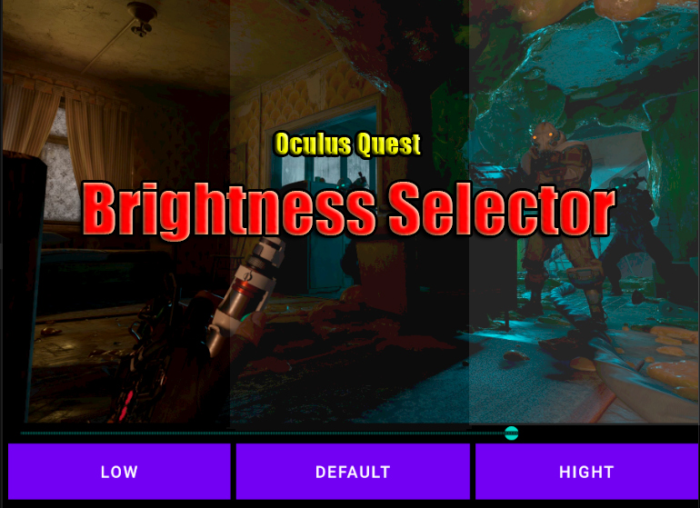
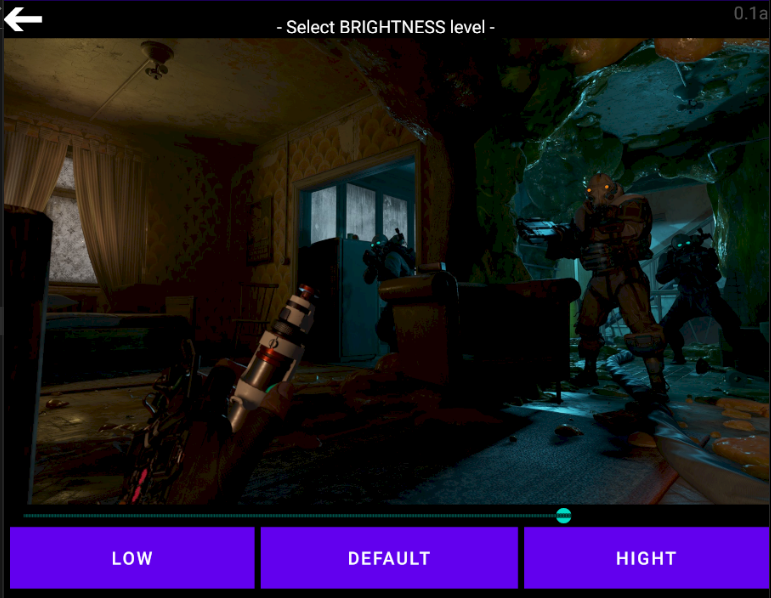
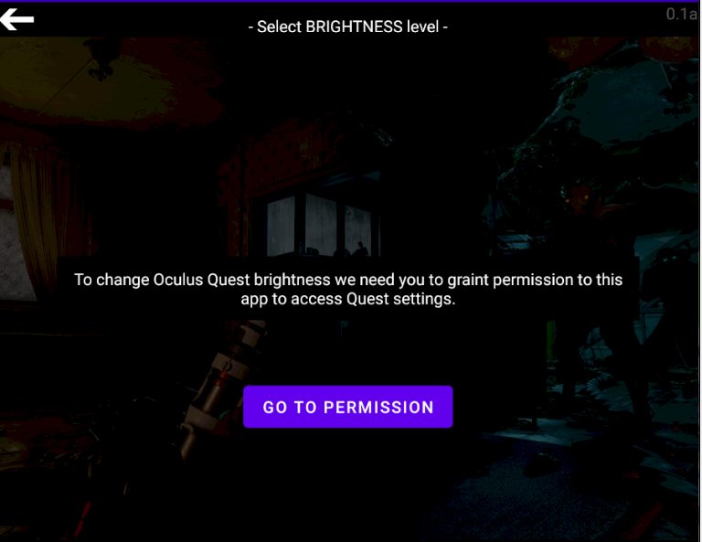

# Quest2Brightness

App to allow modify Oculus Quest 2 brightness because Facebook didn't provide this function already

With this app you can manage OCULUS QUEST 2 brightness because currently it's not possible in official configuration menus.

It allows you to get down the brightness to the minimum allowed by the lcd panel in order to aproach to Quest 1 OLED panel as much as possible.

In first launch you have to allow this app to access settings

NOTE: To install that you need to "unlock" external apps installation and then install via ADB commando or SideQuest. There are many SideQuest tutorials to do that

